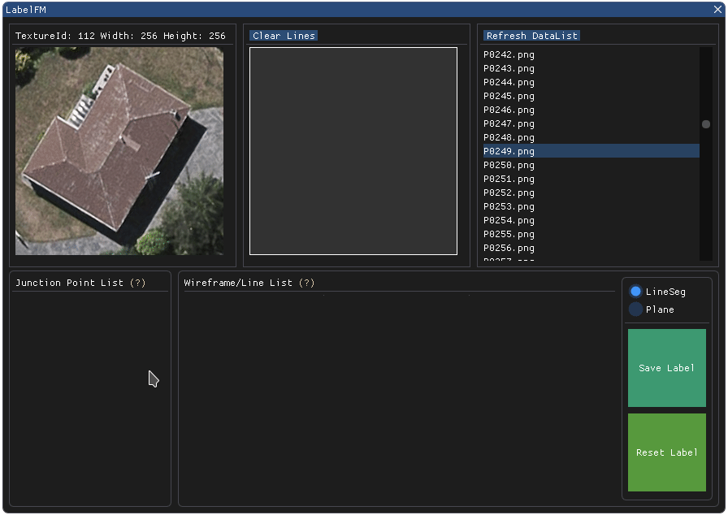
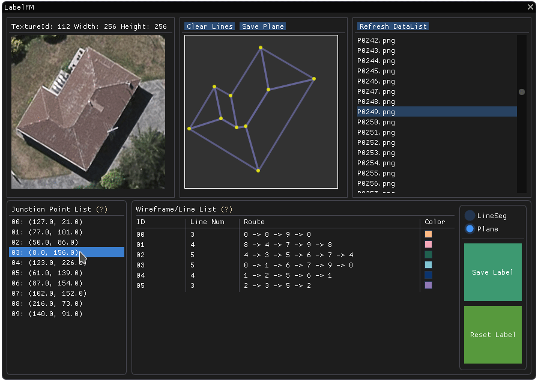
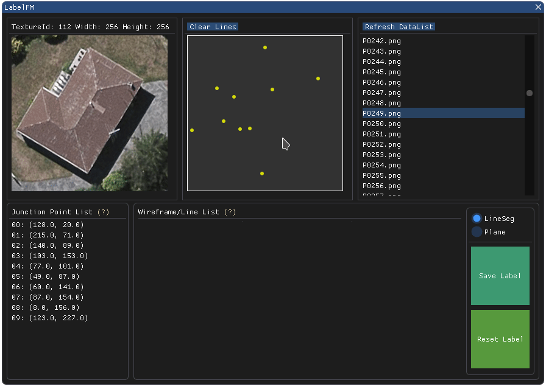
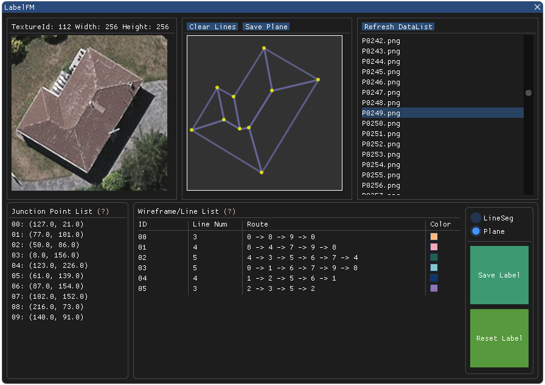

# LabelFM
ImGui based Image Wireframe Annotation Tool.

### Description

LabelFM is a graphical image annotation tool, mainly for image wireframe labeling. It provides two kinds of annotation mode (Line Segment and Plane), which is very helpful for creating different types of data.

The GUI used in LabelFM is originally [Dear ImGui](https://github.com/ocornut/imgui), a C++ GUI library. For fast development, a Python binding [pyimgui](https://github.com/swistakm/pyimgui) is utilized in this project. Currently, the whole project is a Python implementation.

### Requirements

The Dependency of this project is almost the same as pyimgui. In this project, the GLFW3 is used as the rendering backend. To install imgui with different built-in backend integrations, just follow the installation guide of pyimgui: [pyimgui.readthedocs.io](https://pyimgui.readthedocs.io/en/latest/index.html).

Besides, The Image library Pillow and the python fundamental package NumPy are also needed.

### Examples

Before line segment annotation, you need to click the loaded image to add point data.

Note that the point item can be selected to help you check the point annotation.

This Annotation Tool provides two kinds of mode, one for general line segment annotation, the other for plane wireframe annotation. You need to select the corresponding radio button to change the mode.

After annotation, click **Save Label** button to save your label of the current image.

To start another image annotation, click **Reset Label** button to clear all the current labeling data.