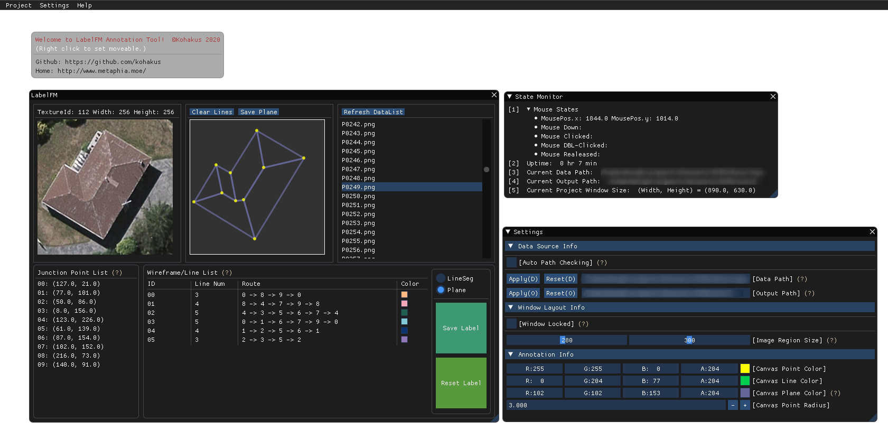

# LabelFM
**ImGui based Image Wireframe Annotation Tool.**

### Description

LabelFM is a graphical image annotation tool, mainly for image wireframe labeling. It provides two kinds of annotation mode (Line Segment and Plane), which is very helpful for creating different types of data.

The GUI used in LabelFM is originally [Dear ImGui](https://github.com/ocornut/imgui), a C++ GUI library. For fast development, a Python binding [pyimgui](https://github.com/swistakm/pyimgui) is utilized in this project. Currently, the whole project is a Python implementation.