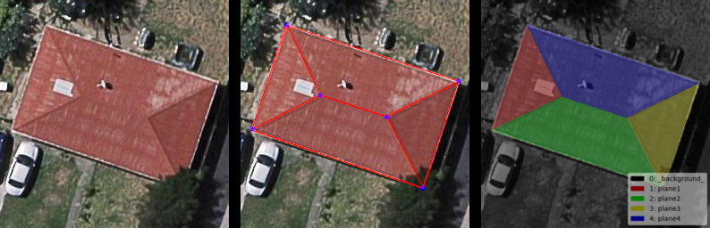
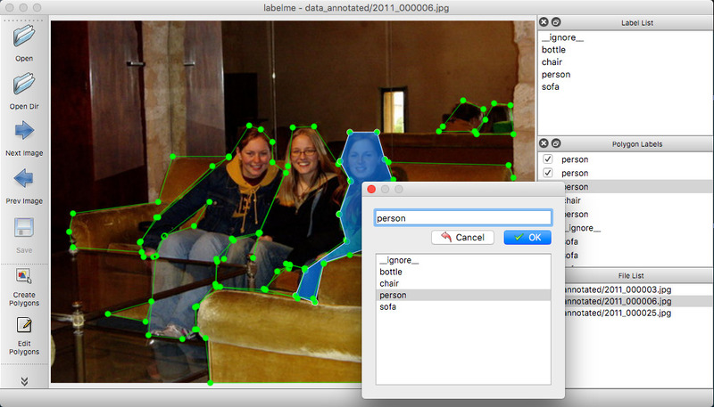
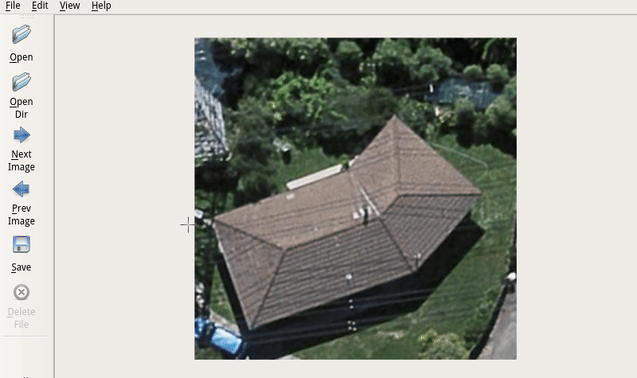
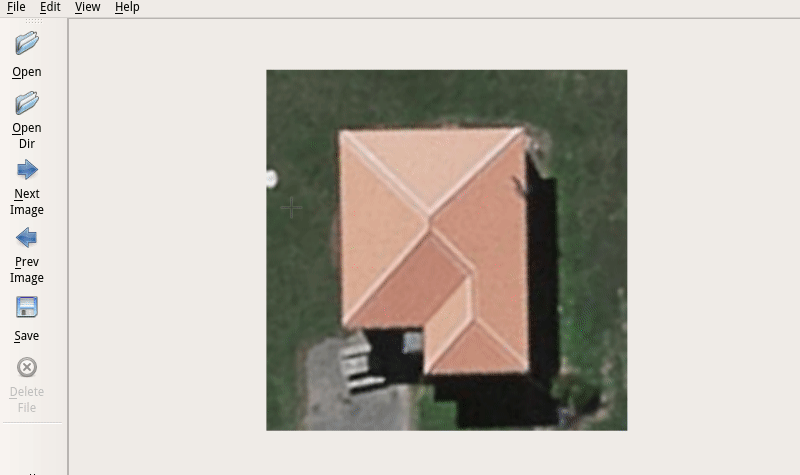
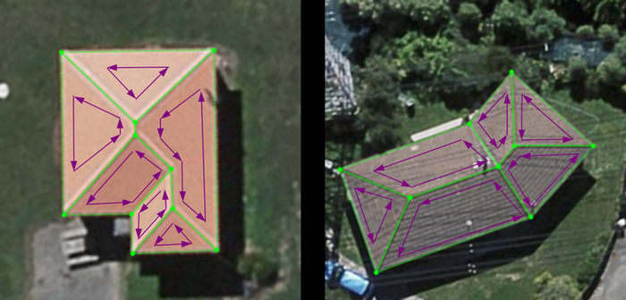

## 平面实例标注工具（Plane Instance Annotation Tool）

### 一. 标注说明

- 标注类型：单张 RGB 三通道彩色图像

- 标注信息：平面实例的**掩模**（Mask）与**线框**（Wireframe）表示
  - 平面掩模：标注<u>每个像素</u>，为每个平面实例设置独立的标签（如 1, 2, 3, ...）
  - 平面线框：标注<u>合流点</u>，并给出他们之间的连接关系
  
- 标注可视化：
  - 平面掩模：使用常用的语义分割数据集（如 PASCAL VOC）的可视化颜色映射
  - 平面线框：将所标注线框的几何信息（点的浮点坐标，点之间的连接）绘制在图像上
  
- 目标标注样例：

  
  
  从左到右依次为待标注图片（高宽尺寸 256$\times$256），平面线框标注可视化与平面掩模标注可视化结果。
  
  图示样例中，共标注 4 个平面，分别对应标签 1, 2, 3, 4 四个数字。数字 0 代表背景标注。
  
### 二. 相关标注工具

&emsp;&emsp;与我们的标注目标最相关的标注工具类型有：语义/实例分割标注工具，人体关键点标注工具，目标框标注工具等。一些开源可获取的标注项目往往可以对多种数据（图像，视频以及点云等）进行标注，几种常用的标注工具项目信息如下：

- [LabelMe](https://github.com/wkentaro/labelme)：常用的语义分割标注工具，可以进行语义/实例分割相关数据的标注
- [LabelImg](https://github.com/tzutalin/labelImg)：常用的 Bounding Box 标注工具，可用于检测数据的标注
- [CVAT](https://github.com/opencv/cvat)：OpenCV官方的标注工具，可进行图像分类、目标检测、语义/实例分割，支持本地部署
- [VoTT](https://github.com/Microsoft/VoTT/#labeling-an-image)：微软开发的标注工具，界面美观简洁，附带自动化目标检测辅助工具，支持图像和视频的目标检测数据标注
- [VIA-VGG](http://www.robots.ox.ac.uk/~vgg/software/via/)：多功能标注工具，支持图像、视频、人脸等相关任务的数据标注，基于 Web 并可在本地部署
- [COCO-UI](https://github.com/tylin/coco-ui)：微软 COCO 数据集的标注工具，包含图像分割、检测与人体关键点等数据的标注

&emsp;&emsp;从目前已经开源的相关标注工具项目总结中可以发现，语义分割与目标检测这两类任务是被广泛支持的，且都具有较为成熟的标注工具，可以进行高效的线上（基于Web）与线下的数据标注工作。但是，对于我们的平面实例标注，在使用目前的大部分标注工具时上存在一些问题，使得标注不甚高效：

- 不能很好地契合我们的标注类型格式，难以高效生成我们所需要的紧凑的标注数据
- 仅能分别针对某一类任务进行标注，标注后的数据还需要经过整理和序列化
- 标注过程不能很好的满足我们任务的特殊需求，不能产生具有高度一致性的平面标注数据

对于我们的平面实例标注，典型的语义分割标注工具如 LabelMe 基本可以满足我们对平面掩模的标注需求，其标注界面如下：

标注工具 LabelMe 的主要标注过程是针对不同的标注对象，用多边形将其围起来，并生成相应的标记。

但是，对于我们的标注任务它是不够好的，它在标注时只能针对每一个对象进行，具体标注过程如下所示：

&emsp;&emsp;从上面两个标注例子可以发现，现有的掩模标注工具需要我们针对每一个待标注实例进行多边形线框的绘制。但是，在我们的实际数据中，每个合流点（Junction）应该是被多个平面所共用的。具体来说，对于给出的两个例子，我们均标注了 6 个平面，以第二个例子为例，可以发现：

- 单独标注每个平面对应的多边形：需要标记 $4+3+6+3+4+4=24$ 个点
- 标记合流点：仅需要标记 10 个点

实际上，我们只需要对合流点（junction）进行标注，并确定他们之间的连接关系即可。如有必要，还可以进行标注顺序记录。

&emsp;&emsp;虽然存在上述问题，直接利用现有的工具标注掩模是有一定可行性的，但是会存在较大的标注效率问题。然而，即使我们不考虑上述问题对掩模标注的效率影响，我们也会发现这种标注方式还存在着一些不够好的地方。具体来说，虽然可以直接利用该种工具进行平面掩模的标注，但考虑到后续的线框（Wireframe）标注，可能会存在一致性的问题，即平面线框实例与平面的掩模实例标注应该是有严格对应关系的，对应的合流点的几何位置也最好是一致的。

### 三. 对标注工具的实际需求

&emsp;&emsp;针对第二节中阐述的问题，我们需要一种高效且合理的标注工具，以快速产生平面实例标注的数据集。针对第一节中所述的标注任务需求，在现有标注工具的基础上，目前的理想标注工具可能还需要下列功能：

- 能够单独针对“点”（Point）进行精确位置标注，以 $(x,y)$ 坐标给出，并给予唯一序号

- 能够从已标注好的点中拉出“线”（Line）并与其它点进行连接，线段以点的序号序对 $(a,b)$ 表示 

- 能够以点为单位进行回路（Circle）标注，对应于每个平面，且能够记录回路的标注顺序，构成有向图

  

- 能够从标注好的平面线框（Plane Wireframe）直接生成每个平面对应的掩模标注

- 将原始图像、掩模标注、线框标注、标注参数等信息直接序列化为紧凑的数据形式，方便程序加载